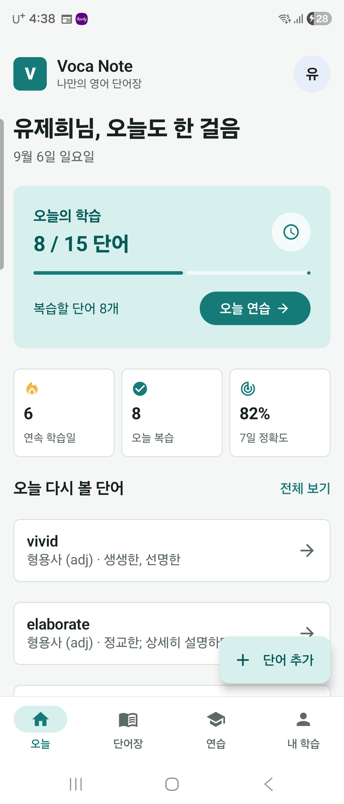
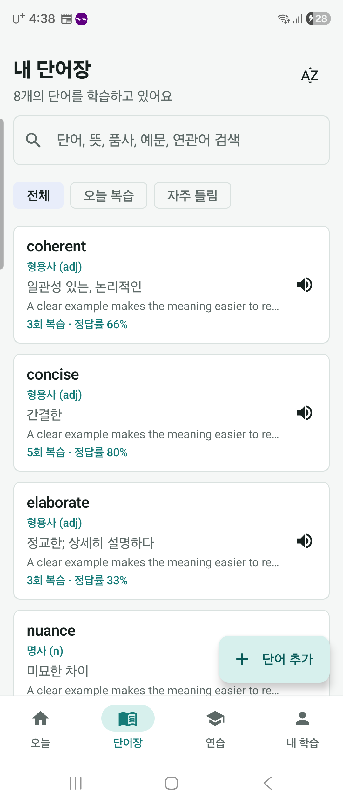
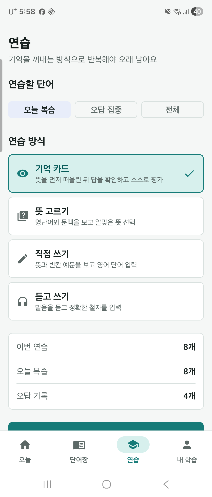
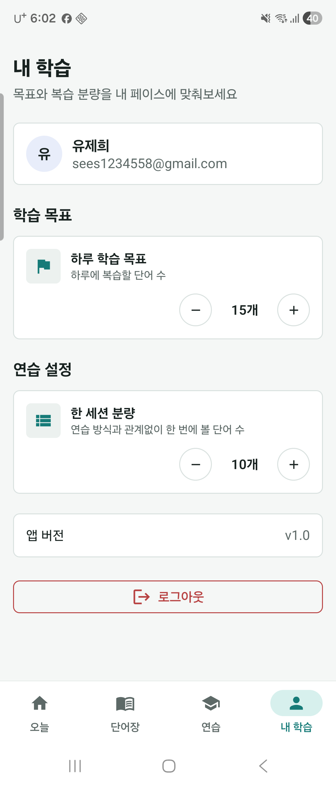
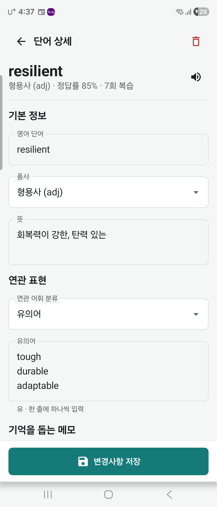
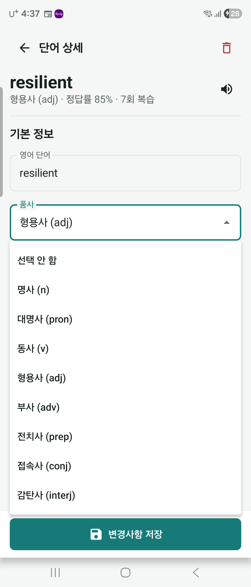
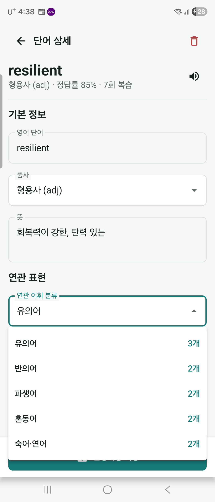
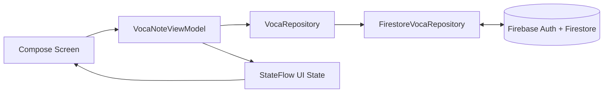

<div align="center">
  <h1>Voca Note</h1>
  <p><strong>직접 모은 영어 단어를 능동 회상과 간격 반복으로 오래 기억하는 Android 앱</strong></p>
  <p>
    
    
    
    
  </p>
</div>

Voca Note는 단어를 저장하는 데서 끝나지 않습니다. 답을 보기 전에 먼저 떠올리고, 쓰고, 듣고, 틀린 단어를 다시 풀게 하며 학습 결과에 따라 다음 복습 시각을 자동으로 조정합니다. 모든 단어와 학습 기록은 사용자별 Firebase 공간에 실시간 동기화됩니다.

## Screens

<table>
  <tr>
    <td width="50%" align="center">
      <br>
      <strong>오늘</strong><br>
      목표 진행률, 연속 학습일, 7일 정확도와 복습 대상을 한곳에서 확인합니다.
    </td>
    <td width="50%" align="center">
      <br>
      <strong>단어장</strong><br>
      단어·뜻·품사·예문 검색, 오늘 복습과 오답 필터, 학습 우선순 정렬을 지원합니다.
    </td>
  </tr>
  <tr>
    <td width="50%" align="center">
      <br>
      <strong>연습</strong><br>
      기억 카드, 뜻 고르기, 직접 쓰기, 듣고 쓰기 중 원하는 훈련을 선택합니다.
    </td>
    <td width="50%" align="center">
      <br>
      <strong>내 학습</strong><br>
      하루 목표와 세션 분량을 정하고 Firebase 계정 정보를 관리합니다.
    </td>
  </tr>
  <tr>
    <td width="50%" align="center">
      <br>
      <strong>단어 상세</strong><br>
      고정 저장 버튼으로 어느 위치에서든 저장하고 새 단어를 연속으로 추가합니다.
    </td>
    <td width="50%" align="center">
      <br>
      <strong>8품사 선택</strong><br>
      명사 (n)부터 감탄사 (interj)까지 드롭다운에서 선택해 단어와 함께 학습합니다.
    </td>
  </tr>
  <tr>
    <td colspan="2" align="center">
      <br>
      <strong>연관 어휘</strong><br>
      유의어·반의어·파생어·혼동어·숙어/연어를 전환하며 한 화면에 모아 기록합니다.
    </td>
  </tr>
</table>

## Learning Flow

1. 강의, 문서, 영상에서 만난 단어와 뜻을 기록합니다.
2. 품사와 유의어·반의어·파생어·혼동어·숙어/연어를 묶어 단어의 쓰임을 확장합니다.
3. 오늘 복습할 단어를 기억 카드, 선택형, 쓰기, 듣기로 꺼내 봅니다.
4. 틀린 단어만 즉시 다시 연습합니다.
5. 성공하면 `1일 → 3일 → 이전 간격의 2배`로 늘리고, 실패하면 10분 뒤 다시 보여 줍니다.
6. 세션 결과, 다음 복습 시각, 연속 학습일과 정확도를 Firebase에 저장합니다.

## Features

| 영역 | 제공 기능 |
| --- | --- |
| 계정 | Credential Manager 기반 Google 로그인, Firebase Authentication |
| 단어 | 연속 추가, 약어를 포함한 8품사 선택, 유의어·반의어·파생어·혼동어·숙어/연어, 예문, 메모, Android TTS 발음 |
| 탐색 | 단어·뜻·품사·예문·연관어 통합 검색, 오늘 복습/오답 필터, 알파벳/최근/학습 우선순 정렬 |
| 연습 | 품사를 함께 보여 주는 능동 회상 카드, 4지선다, 빈칸 예문 쓰기, 듣고 철자 쓰기 |
| 반복 | 다음 복습 시각 계산, 오답 즉시 재연습, 최대 180일 간격 반복 |
| 통계 | 오늘 학습량, 일일 목표, 연속 학습일, 최근 7일 정확도 |
| 동기화 | 사용자별 단어·설정·세션을 Firestore snapshot listener로 실시간 반영 |
| UI | Material 3 기반 단일 라이트 테마, 휴대폰·태블릿 최대 폭 대응 |

## Architecture



```text
app/src/main/java/com/example/vocanote
├── auth/                 # Google Credential + Firebase Auth
├── core/
│   ├── data/             # Repository 계약과 Firestore 구현
│   ├── designsystem/     # 공통 레이아웃과 UI 컴포넌트
│   ├── model/            # 단어, 통계, 간격 반복 순수 로직
│   └── speech/           # Android TTS 래퍼
├── features/
│   ├── editor/           # 단어 CRUD와 입력 검증
│   ├── home/             # 오늘의 목표와 복습 대상
│   ├── library/          # 검색, 필터, 정렬
│   ├── review/           # 문제 엔진과 연습 세션
│   └── settings/         # 학습량과 계정 설정
└── ui/                   # 전역 상태와 Navigation 조립
```

화면은 Firebase SDK를 직접 참조하지 않습니다. `VocaNoteViewModel`이 로그인 세션과 구독을 소유하고, 플랫폼과 무관한 학습 규칙은 JVM 단위 테스트가 가능한 순수 함수로 분리되어 있습니다.

## Firestore

```text
users/{uid}/words/{wordId}
  word, wordLowercase, meaning, partOfSpeech, example, note
  synonyms, antonyms, derivatives, confusableWords, collocations
  correctCount, incorrectCount, reviewStreak, reviewIntervalDays
  createdAt, updatedAt, lastReviewedAt, nextReviewAt

users/{uid}/settings/review
  sessionSize, dailyGoal, updatedAt

users/{uid}/reviewSessions/{sessionId}
  mode, questionCount, correctCount
  wordIds, incorrectWordIds, completedAt
```

복습 결과와 세션 이력은 하나의 Firestore batch로 저장합니다. 저장소의 [`firestore.rules`](firestore.rules)는 로그인 사용자가 자신의 경로만 읽고 쓰도록 제한하고 문자열 길이, 설정 범위, 세션 크기와 학습 간격을 서버에서도 검증합니다.

```bash
firebase emulators:exec --only firestore --project demo-voca-note true
firebase deploy --only firestore:rules
```

## Run

1. Android Studio에서 프로젝트를 열고 JDK 17 이상을 선택합니다.
2. Firebase Android 앱의 `google-services.json`을 `app/`에 둡니다.
3. Firebase Authentication에서 Google 로그인을 활성화하고 SHA-1/SHA-256을 등록합니다.
4. API 24 이상 기기에서 앱을 실행합니다.

```bash
./gradlew assembleDebug
adb install -r app/build/outputs/apk/debug/app-debug.apk
```

로그인이나 서버 데이터 없이 화면만 확인할 때는 debug 전용 UI 카탈로그를 사용할 수 있습니다.

```bash
adb shell am start -n com.example.vocanote/.debug.UiCatalogActivity --es screen home
# screen: home, library, review, settings, editor, new-editor
```

## Verification

```bash
./gradlew testDebugUnitTest
./gradlew lintDebug
./gradlew assembleDebug assembleRelease
```

단위 테스트는 입력 검증, 네 가지 문제 생성, 정답 비교, 오답 기준, 간격 반복 경계, 학습 통계와 설정 범위를 다룹니다. Release 빌드는 R8 코드 축소와 리소스 최적화를 적용합니다.
